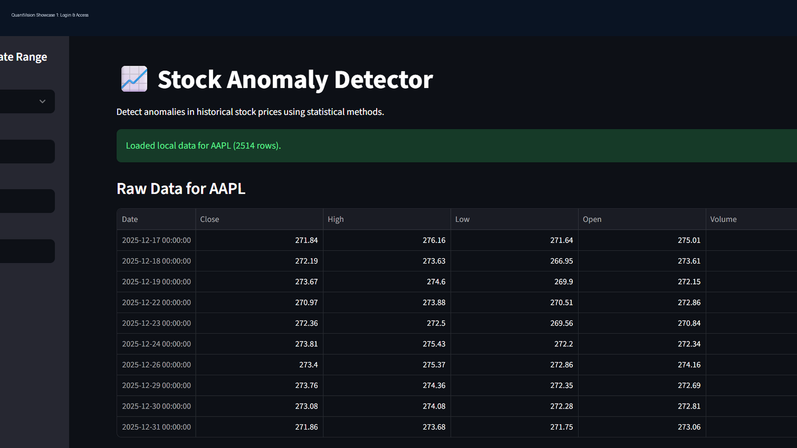
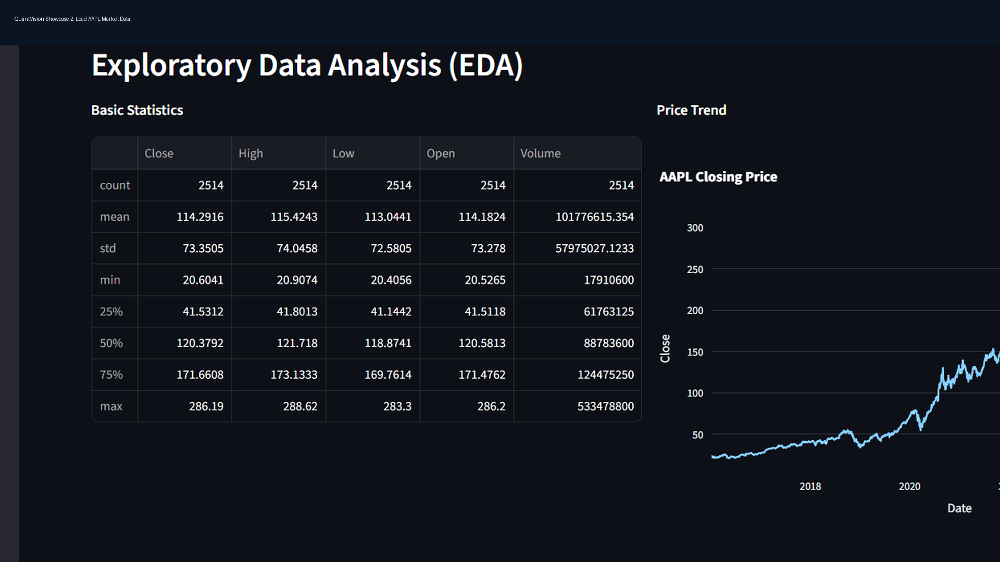
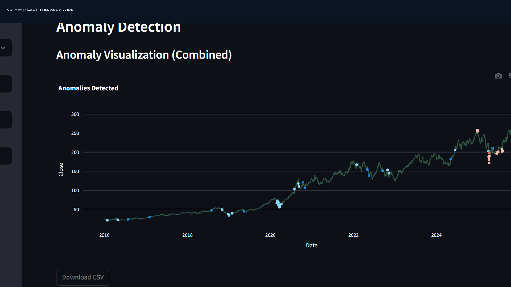

# Stock Anomaly Detector

[](https://github.com/TomasPosada0626/Stock-Anomaly-Detector/actions/workflows/ci.yml)
[](https://codecov.io/gh/TomasPosada0626/Stock-Anomaly-Detector)

Professional anomaly detection app for historical stock prices using statistical and machine learning methods.

Live demo: [https://stock-anomaly-detector-tomas.streamlit.app/](https://stock-anomaly-detector-tomas.streamlit.app/)

## Why This Project Is Valuable

- Real product interface with authentication and sessions.
- Multiple anomaly detection approaches in one app.
- Reproducible experiments through notebooks.
- Automated tests for critical methods.
- Docker support for portable deployment.

## Tech Stack

- Python 3.11+
- Streamlit
- Pandas, NumPy
- Scikit-learn, DBSCAN, Isolation Forest
- Prophet
- yfinance (market data ingestion)
- Plotly, Matplotlib, Seaborn, Kaleido
- SQLite (local persistence)
- bcrypt (password hashing + legacy migration)
- Pytest, pytest-cov
- Ruff, Black
- Bandit, pip-audit
- Docker
- GitHub Actions + Codecov

## Project Structure

```text
src/
  app.py
  anomaly_methods.py
  utils.py
  services/
    auth_service.py
    market_data_service.py
  ui/
    auth_ui.py
    charts.py
tests/
  test_anomaly_methods.py
  test_auth_integration.py
  test_market_data_service.py
  test_ui_charts.py
notebooks/
  stock_anomaly_analysis.ipynb
  deep_learning_anomaly_case_studies.ipynb
data/
Dockerfile
requirements.txt
requirements-notebooks.txt
runtime.txt
README.md
FAQ.md
DEPLOYMENT.md
ARCHITECTURE.md
CONTRIBUTING.md
pytest.ini
pyproject.toml
```

Runtime artifacts (`users.db`, logs, cache files) are excluded from version control.

## Quick Start (Windows PowerShell)

```powershell
python -m venv .venv
.\.venv\Scripts\Activate.ps1
pip install -r requirements.txt
streamlit run src/app.py
```

Open: http://localhost:8501

## Running Tests

```bash
pytest
```

Integration tests for auth/register/login are included in `tests/test_auth_integration.py`.

Coverage report for core detection modules:

```bash
pytest --cov=src --cov-report=term-missing
```

Note: `src/app.py` is excluded from coverage because it is Streamlit UI entrypoint code; coverage targets all testable service and algorithm modules.

## Quality and Security Checks

GitHub Actions runs these jobs on every push/PR to `main`:

- `test`: unit/integration tests + coverage upload
- `quality`: `ruff check` + `black --check`
- `security`: `bandit` static analysis + `pip-audit` dependency scan

## Optional Notebook Dependencies

The deployed app uses `requirements.txt`.

If you want to run advanced deep-learning notebooks locally, install optional dependencies:

```bash
pip install -r requirements-notebooks.txt
```

## Features

- Multi-ticker analysis (Yahoo Finance)
- CSV upload support
- Methods: Z-Score, Isolation Forest, DBSCAN, Prophet, Rolling Quantile
- Interactive anomaly visualization
- Export plots as PNG (environment permitting)
- Local user login and session management
- Secure password hashing with bcrypt and legacy hash auto-upgrade

## Available Documentation

- Setup and usage: [FAQ.md](FAQ.md)
- Deployment options: [DEPLOYMENT.md](DEPLOYMENT.md)
- System design: [ARCHITECTURE.md](ARCHITECTURE.md)
- Contribution workflow: [CONTRIBUTING.md](CONTRIBUTING.md)
- Version history: [CHANGELOG.md](CHANGELOG.md)
- Contributors: [CONTRIBUTORS.md](CONTRIBUTORS.md)

## Deployment Summary

Implemented in this repository:
- Local run with Python
- Docker deployment via `Dockerfile`

Documented (manual setup required):
- Streamlit Community Cloud
- Any Docker-compatible cloud platform

Not yet implemented:
- Automated deployment job (CD)

## Notes for Recruiters

This project demonstrates:
- Applied ML for anomaly detection
- Product-minded UX in Streamlit
- Testing discipline
- Deployment readiness with Docker
- Security hardening (bcrypt, lockout policy, session expiration, audit trail)

## Key Engineering Practices

- Layered modular architecture (UI, services, algorithms)
- Integration tests for authentication/session flows
- Coverage-driven validation with CI gates
- Security hardening with bcrypt and static/dependency scans

## Screenshots

| Main Dashboard | EDA View | Anomaly Visualization |
|---|---|---|
|  |  |  |

## License

MIT (see [LICENSE](LICENSE))
