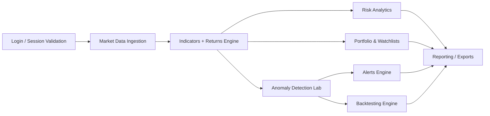

# QuantVision

[](https://github.com/TomasPosada0626/QuantVision/actions/workflows/ci.yml)
[](https://codecov.io/gh/TomasPosada0626/QuantVision)

**Intelligent Financial Analytics Platform**

QuantVision is a production-grade FinTech analytics platform built with Python and Streamlit.
It provides anomaly detection, technical analysis, portfolio intelligence, risk analytics,
alerts, and strategy backtesting in a modular architecture aligned with Clean Code and SOLID practices.

## Product Vision
QuantVision helps analysts and investors:
- Monitor market behavior through professional dashboards.
- Detect outliers using statistical and machine learning models.
- Compare assets with return, volatility, correlation, and drawdown analytics.
- Manage portfolios, watchlists, and actionable alert workflows.
- Evaluate strategies with a backtesting engine and benchmark against Buy & Hold.

## Architecture
The project follows a modular service-driven structure:
- `src/app.py`: Streamlit application entrypoint.
- `src/services`: business services (auth, market data, indicators, risk, portfolio, alerts, watchlists, backtesting).
- `src/ui`: reusable visual components and Plotly chart builders.
- `src/config`: typed runtime settings and environment-aware configuration.
- `src/anomaly_methods.py`: anomaly ML/statistical methods.
- `tests`: unit, integration, smoke, and e2e suites.

Design principles:
- Separation of concerns and high cohesion.
- Explicit interfaces between UI and service layers.
- Extensible modules for new asset classes and analytics features.

## Core Technologies
- Python 3.11+
- Streamlit
- Pandas / NumPy
- Plotly
- Scikit-Learn
- Prophet
- yfinance
- SQLite (persisted domain state)
- bcrypt authentication hardening

## Feature Map
- Authentication with secure sessions, lockout policy, and audit events.
- Role-based access control (Admin, Analyst, Guest) with module-level gating.
- Professional market dashboard with KPI cards and advanced charts.
- Candlestick, volume, and multi-asset comparison visualizations.
- Technical indicators:
  - RSI, MACD, SMA, EMA, Bollinger Bands, VWAP, ATR, ADX,
  - Ichimoku Cloud, OBV, Stochastic Oscillator.
- Anomaly detection:
  - Z-Score, Isolation Forest, DBSCAN, Prophet, Rolling Quantile,
  - Local Outlier Factor (LOF), One-Class SVM.
- Portfolio tracker with invested capital, current value, PnL, and ROI.
- Watchlist management with persistent custom lists.
- Alert rules and alert history.
- Scheduled alert evaluation service for recurring scans.
- Backtesting engine with trade, win-rate, drawdown, and benchmark metrics.
- Report center with PDF, CSV, and PNG exports.
- Risk analytics:
  - Sharpe, Sortino, Maximum Drawdown, Volatility, Beta, Alpha, Correlation, VaR.
- FastAPI layer for health checks and portfolio/alerts endpoints.

## Use Cases
- Buy-side technical analysis workflow.
- Retail portfolio monitoring and anomaly-based screening.
- Quant experimentation and model comparison.
- Interview-ready FinTech engineering portfolio demonstration.

## Installation
### Local Environment
```bash
python -m venv .venv
# Windows
.\.venv\Scripts\Activate.ps1
pip install -r requirements.txt
streamlit run src/app.py
```

### Docker
```bash
docker build -t quantvision .
docker run -p 8501:8501 quantvision
```

## Configuration
Main env variables:
- `ENVIRONMENT`
- `USERS_DB_PATH`
- `APP_LOG_DIR`
- `STREAMLIT_APP_URL`
- `SESSION_TTL_MINUTES`
- `MAX_FAILED_LOGIN_ATTEMPTS`
- `LOCKOUT_MINUTES`
- `SCHEDULER_INTERVAL_MINUTES`
- `SCHEDULER_RUN_CONTINUOUS`
- `SCHEDULER_WORKER_MODE`
- `SCHEDULER_MAX_CYCLES`
- `SCHEDULER_MAX_CONSECUTIVE_FAILURES`
- `SCHEDULER_HEARTBEAT_FILE`
- `USE_SQLALCHEMY_REPOSITORIES`
- `DATABASE_URL`

Reference examples:
- `config/env/.env.development.example`
- `config/env/.env.production.example`

Persistence mode:
- `USE_SQLALCHEMY_REPOSITORIES=false`: SQLite-native repositories in service layer.
- `USE_SQLALCHEMY_REPOSITORIES=true`: SQLAlchemy repositories via `DATABASE_URL`.

PostgreSQL production bootstrap:
- Install dependencies: `pip install -r requirements.txt`
- Set environment:
  - `USE_SQLALCHEMY_REPOSITORIES=true`
  - `DATABASE_URL=postgresql+psycopg://<user>:<password>@<host>:5432/<db_name>`
- Run schema bootstrap/versioning:
  - `python scripts/bootstrap_postgres.py`
- Migration state is tracked in table `schema_migrations`.
- Domain schema versioning entrypoint: `src/repositories/sqlalchemy_migrations.py`.

Scheduler fallback mode:
- APScheduler available: interval jobs in process.
- APScheduler unavailable and `SCHEDULER_RUN_CONTINUOUS=true`: continuous all-users loop.
- APScheduler unavailable and `SCHEDULER_RUN_CONTINUOUS=false`: single all-users pass and exit.

Scheduler worker mode (recommended for cloud worker dynos/containers):
- `SCHEDULER_WORKER_MODE=true`
- `SCHEDULER_INTERVAL_MINUTES=15`
- `SCHEDULER_MAX_CYCLES=0` (0 = infinite)
- `SCHEDULER_MAX_CONSECUTIVE_FAILURES=10`
- `SCHEDULER_HEARTBEAT_FILE=storage/logs/scheduler_heartbeat.json`
- Run worker process: `python scripts/run_scheduler.py`

## Security
- Password hashing via bcrypt.
- Login lockout after repeated failures.
- Session TTL and invalidation.
- Authentication audit trail.

## Testing and Quality
```bash
pytest
pytest --cov=src --cov-report=term-missing
ruff check src tests
black --check src tests
```

Quality expectations:
- High test coverage target (>=95%).
- CI gates for tests, lint, formatting, and security scans.

## CI/CD
GitHub Actions validates:
- Unit/integration/smoke tests
- Coverage threshold
- Lint and format
- Security checks
- E2E smoke flow

## Reports and Exports
- Executive PDF report generation.
- CSV export of analysis datasets.
- PNG export of visualizations.
- Structured analytics tables for executive and technical reporting workflows.

## API Layer
FastAPI entrypoint:
- `src/api/main.py`

Current endpoints:
- `GET /health`
- `GET /health/detailed`
- `GET /metrics`
- `POST /auth/login`
- `POST /auth/logout`
- `GET /users/{username}/role`
- `GET /users/{username}/portfolio/summary`
- `GET /users/{username}/portfolio/positions`
- `POST /users/{username}/portfolio/positions`
- `DELETE /users/{username}/portfolio/positions/{position_id}`
- `GET /users/{username}/alerts/history`
- `GET /users/{username}/alerts/rules`
- `POST /users/{username}/alerts/rules`
- `DELETE /users/{username}/alerts/rules/{rule_id}`
- `GET /users/{username}/watchlists`
- `POST /users/{username}/watchlists`
- `DELETE /users/{username}/watchlists/{watchlist_id}`
- `GET /users/{username}/watchlists/{watchlist_id}/items`
- `POST /users/{username}/watchlists/{watchlist_id}/items`
- `DELETE /users/{username}/watchlists/{watchlist_id}/items/{ticker}`

## Deployment
See:
- `docs/operations/DEPLOYMENT.md`
- `docs/operations/RUNBOOK.md`

## Roadmap
- PostgreSQL option for enterprise data persistence.
- Strategy research notebook-to-production pipeline.
- Multi-factor portfolio optimization module.

## Benchmarks
The anomaly lab includes method-level execution timing and anomaly counts,
allowing direct benchmark comparisons across selected detection models.

## Application Flow


## Documentation
- `docs/architecture/ARCHITECTURE.md`
- `docs/guides/FAQ.md`
- `docs/operations/DEPLOYMENT.md`
- `docs/operations/RUNBOOK.md`

## License
MIT. See `LICENSE`.
